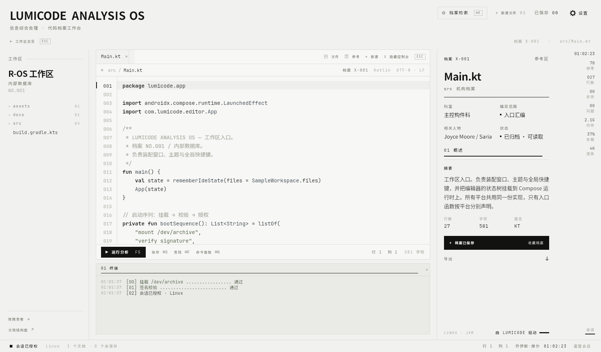
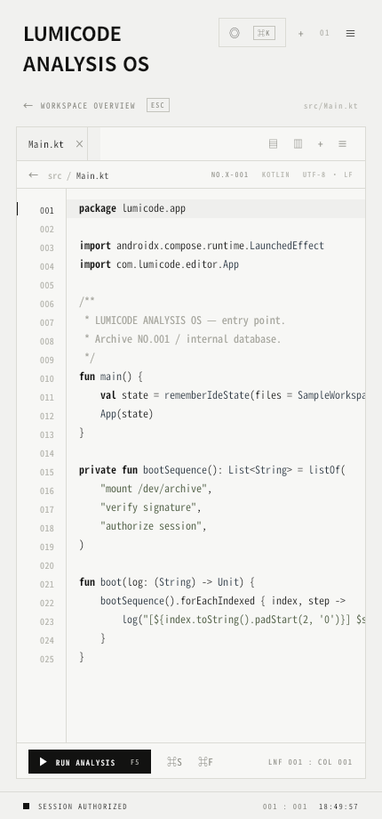
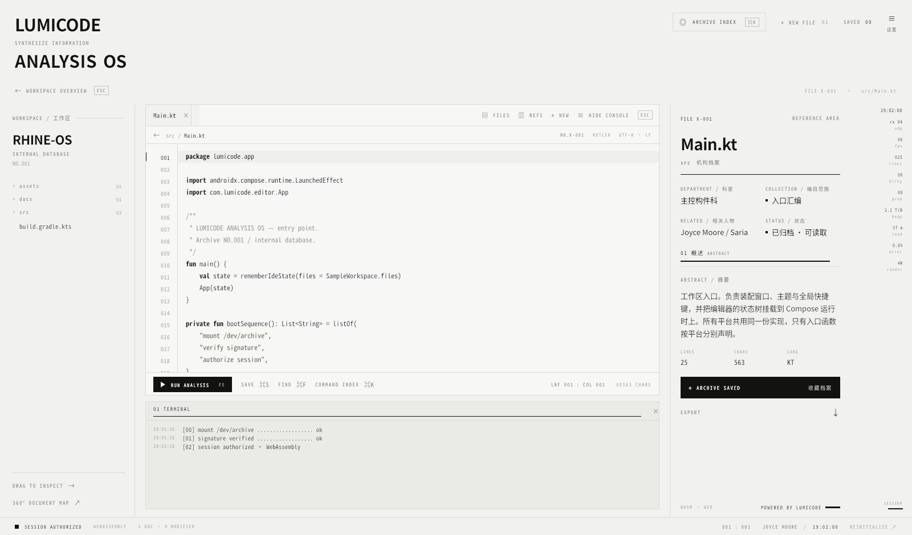

# LUMICODE — ANALYSIS OS

一个「档案室／分析终端」风格的代码编辑器 Demo，使用 **Compose Multiplatform** 编写，同一份 UI 代码同时运行在
**Android / Windows / Linux / Web(Wasm)** 四个平台。视觉语言参考了 *RHINE LAB ANALYSIS OS* 那种纸质底色 +
1px 细线 + 微缩等宽标签 + 大写字标的归档界面（未使用 3D 模型，改为纯 2D 版式）。



---

## 1. 已实现的 IDE 基础功能

| 功能 | 说明 |
| --- | --- |
| 文件树 | 左侧 WORKSPACE 面板，文件夹可折叠，脏文件带标记 |
| 多标签编辑 | 打开 / 关闭 / 切换文档，未保存显示圆点 |
| 代码编辑 | 等宽字体、行号栏、当前行高亮、Tab 缩进、回车自动缩进、括号/引号自动补全 |
| 语法高亮 | Kotlin / Gradle KTS / JSON / Markdown / 纯文本，纯 Kotlin 正则词法分析，四端一致 |
| 查找 | `Ctrl+F` 文档内查找，命中高亮、上一个/下一个、命中计数 |
| 命令面板 | `Ctrl+K` COMMAND INDEX，支持键盘上下选择与回车执行 |
| 快速打开 | `Ctrl+P` 按文件名/路径过滤并跳转 |
| 输出面板 | TERMINAL / PROBLEMS / ACCESS LOG 三个归档页签；PROBLEMS 由内置静态检查生成（TODO 标记、超长行、括号不平衡） |
| 分析任务 | `F5` 模拟一次分析流程，逐行输出到控制台并更新状态栏 |
| 参考区 | 右侧 REFERENCE AREA：文件元数据、摘要、结构大纲（点击跳转行）、访问日志 |
| 状态栏 / 遥测栏 | 行列号、字符数、文档数、脏文件数、真实 FPS、平台标识、时钟 |

### 快捷键

| 按键 | 行为 |
| --- | --- |
| `Ctrl/Cmd + K` | 命令面板 |
| `Ctrl/Cmd + P` | 快速打开 |
| `Ctrl/Cmd + S` | 保存（写入虚拟档案，SAVED 计数 +1） |
| `Ctrl/Cmd + F` | 查找 |
| `Ctrl/Cmd + N` | 新建文件 |
| `Ctrl/Cmd + W` | 关闭当前文档 |
| `Ctrl/Cmd + B` / `Ctrl/Cmd + J` | 显示/隐藏资源管理器 / 控制台 |
| `F5` 或 `Ctrl/Cmd + Enter` | 运行分析 |
| `Esc` | 关闭浮层 / 查找栏 |

### 自适应：桌面宽屏 / 手机窄屏

同一份 UI 会自动切换版式：宽度 < 900dp 时收起左右两栏、隐藏遥测栏，资源管理器与参考区改为浮层抽屉，
顶栏与底部状态栏也同步精简。

| 手机窄屏（430×920） | Web (Wasm) |
| --- | --- |
|  |  |

更多界面截图见 [`docs/screenshots/`](docs/screenshots)：编辑、命令面板、查找、分析流程、快速打开、JSON 文档。

---

## 2. 直接下载安装包（Releases）

不想自己编译的话，去 **[Releases → v0.1.0-demo](https://github.com/TetraploidHuman/LumiCode/releases/latest)** 直接下载：

- **Windows（推荐，免安装）**：[`LumiCode-portable.exe`](https://github.com/TetraploidHuman/LumiCode/releases/latest/download/LumiCode-portable.exe)
  —— **单文件，双击即运行**：46 MB，内含完整 JRE；双击后先静默自解压到 `%TEMP%\7zXXXXXXXX`
  再启动（首次约 20–40 秒，期间只有一个小进度窗），关闭程序后临时目录自动清理
- Windows（反复使用更快）：[`LumiCode-windows-portable.zip`](https://github.com/TetraploidHuman/LumiCode/releases/latest/download/LumiCode-windows-portable.zip)
  —— 解压一次后双击 `LumiCode.exe`，之后每次启动只要几秒
- Windows（安装版）：[`LumiCode-1.0.0.msi`](https://github.com/TetraploidHuman/LumiCode/releases/latest/download/LumiCode-1.0.0.msi)
  —— 写开始菜单与卸载项，不想「安装」就用上面两个
- **Android**：[`LumiCode-android-release.apk`](https://github.com/TetraploidHuman/LumiCode/releases/latest/download/LumiCode-android-release.apk)
- Linux / Web：`lumicode_*.deb` 与 `LumiCode-web-wasm.zip`

> 以上 Windows 产物均内置 JRE，**不需要预装 Java**。因为没有代码签名证书，首次运行 Windows 会提示
> 「未知发布者 / Windows 已保护你的电脑」，点「更多信息 → 仍要运行」即可；用 MSI 安装则是 SmartScreen 的「仍要运行」同款提示。

完整清单：

| 平台 | 文件 | 用法 |
| --- | --- | --- |
| Windows | `LumiCode-portable.exe` | **双击即运行（免安装）**，自解压到临时目录 |
| Windows | `LumiCode-windows-portable.zip` | 解压后运行 `LumiCode.exe`（重复启动更快） |
| Windows | `LumiCode-1.0.0.msi` | 安装版（开始菜单 + 卸载项） |
| Android | `LumiCode-android-release.apk` | 直接安装（需允许「未知来源」） |
| Linux | `lumicode_*.deb` | `sudo dpkg -i lumicode_1.0.0_amd64.deb` |
| Web | `LumiCode-web-wasm.zip` | 解压后用任意静态服务器托管 `index.html` |

这些产物由 [`.github/workflows/build.yml`](.github/workflows/build.yml) 在 GitHub Actions 上构建：
Windows runner 上用 jpackage + WiX 出 MSI/便携版/单文件 exe（并实跑冒烟测试），
Ubuntu runner 上出签名 APK、deb 与 Wasm 产物，最后一个 job 汇总发布到 Release。
打 `v*` 标签会自动触发，也可以在 Actions 页面手动 `Run workflow`，产物都是自动的、可复现的。

> Windows 单文件版用 LZMA SDK 的 `7zSD.sfx` 做自解压。这个 2019 年的 SFX 二进制**只认 `setup.exe` 作为入口**
> （`run/setup/install/start` 里只有 `setup.exe` 会被执行，`.cmd` 一律不执行——CI 用带标记文件的迷你载荷逐个实测过），
> 所以载荷根放的是 launcher 副本 `setup.exe` 与配套的 `app/setup.cfg`；
> APK 使用 CI 每次运行临时生成的签名密钥（每次构建都会变），仅适合试用；
> 要长期分发请替换成你自己的 keystore。MSI/便携版内置 JRE，用户无需预装 Java。

---

## 3. 运行方式

环境要求：**JDK 17+**（推荐 21）。Android 目标需要 Android SDK（`ANDROID_HOME` 或 `local.properties` 中的 `sdk.dir`）。
Gradle Wrapper 已包含在仓库中（Gradle 8.13），首次构建会联网下载 Kotlin 2.1.0 / Compose 1.7.3 依赖。

```bash
# 桌面端（Windows / Linux / macOS 通吃，JVM 目标）
./gradlew :composeApp:run

# 桌面端打包
./gradlew :composeApp:createDistributable      # 免安装目录（当前系统）
./gradlew :composeApp:packageMsi               # Windows 安装包（需在 Windows 上执行）
./gradlew :composeApp:packageDeb               # Linux deb 包（需在 Linux 上执行）

# Android
./gradlew :composeApp:assembleDebug            # 产物：composeApp/build/outputs/apk/debug/composeApp-debug.apk
./gradlew :composeApp:installDebug             # 直接安装到已连接设备

# Web (Kotlin/Wasm)
./gradlew :composeApp:wasmJsBrowserDevelopmentRun   # 本地开发服务器（热重载）
./gradlew :composeApp:wasmJsBrowserDistribution     # 静态产物目录：
                                                    # composeApp/build/dist/wasmJs/productionExecutable
```

Web 产物是纯静态文件（`index.html` + `composeApp.js` + `.wasm` + 字体），任意静态服务器即可托管；
`index.html` 里带有归档风格的启动遮罩，Wasm 加载完成后由 Compose 画布覆盖。

仓库自带一个开发用静态服务器（正确返回 `application/wasm` / `font/otf`，避免浏览器回退到慢速实例化）：

```bash
python3 tools/serve_wasm.py                       # http://127.0.0.1:8080
python3 tools/serve_wasm.py --port 9000 --host 0.0.0.0   # 需要局域网访问时
```

> 说明：构建脚本不做平台判断，Windows 与 Linux 使用同一份 `desktop` (JVM) 目标；
> `packageMsi` 只能在 Windows 上执行，`packageDeb` 只能在 Linux 上执行，这是 Compose Desktop 的限制。

---

## 4. 工程结构

```
composeApp/src/
├── commonMain/kotlin/com/lumicode/editor/
│   ├── App.kt                      # 外壳：三段式布局 + 全局快捷键 + 分析任务模拟
│   ├── Telemetry.kt                # 时钟 / 真实 FPS 采样
│   ├── model/
│   │   ├── Workspace.kt            # Language / CodeFile / FileMeta / 目录树构建
│   │   └── SampleWorkspace.kt      # 内置的演示工作区（内存虚拟文件系统）
│   ├── state/
│   │   ├── IdeState.kt             # 单一状态树：标签、内容、脏标记、控制台、诊断
│   │   └── Commands.kt             # 命令面板条目
│   ├── syntax/SyntaxHighlighter.kt # 多语言正则高亮 + 查找命中标注
│   └── ui/
│       ├── theme/RhineTheme.kt     # 颜色 / 字体 / 尺寸（改这里就能换风格）
│       ├── components/Primitives.kt# Label / Rule / Chip / SolidBarButton 等原子组件
│       ├── TopBar.kt               # 报头、导航行、状态栏、遥测栏
│       ├── EditorPanel.kt          # 标签条、面包屑、查找栏、控制台
│       ├── CodeEditor.kt           # 行号 + 高亮 + 编辑（BasicTextField + VisualTransformation）
│       ├── ReferencePanel.kt       # 左侧工作区文件树 + 右侧 REFERENCE AREA
│       └── Overlay.kt              # 命令面板 / 快速打开浮层
├── commonMain/composeResources/font/  # 内置的 4 个字体子集（见下文「字体」）
├── androidMain/                    # MainActivity + Manifest
├── desktopMain/                    # main() + 窗口（Windows/Linux）
└── wasmJsMain/                     # main() + index.html（含归档风格启动遮罩）

tools/serve_wasm.py                 # Wasm 产物静态服务器（正确的 MIME 类型）
tools/build_font_subset.py          # 重新生成字体子集
```

三端入口都只是「创建 `IdeState` 然后调用 `App(state)`」，没有平台分支的 UI 代码。

### 几个实现要点

- **编辑区**：`BasicTextField` + `VisualTransformation` 做高亮，不使用平台文本 API，因此 Android / 桌面 /
  Wasm 的行为完全一致；行号栏与代码共用一个滚动容器，天然对齐。
- **归档版式**：所有面板都是「1px 细线 + 微缩等宽标签 + 大写字标」三层结构，没有圆角与阴影；
  配色集中在 `RlColors`，字号字距集中在 `RlType`，改主题只需要动 `RhineTheme.kt`。
- **虚拟文件系统**：演示工作区写在内存里（`SampleWorkspace`），因此 Wasm 端也能编辑、保存、新建文件；
  若要接真实磁盘，只需在 `desktopMain` 里替换 `IdeState` 的读写实现。
- **字体（重要）**：Wasm 端的 Skia 画布**没有系统字体回退**，直接用系统字族时中文会变成豆腐块。
  因此仓库内置了 `commonMain/composeResources/font/` 下的 4 个字体子集（Noto Sans CJK 与
  Noto Sans Mono CJK 的 SC 字形，400/700 两个字重，各约 140KB），由 `App.kt` 的
  `InstallArchiveFonts()` 在运行时装载进 `RlFonts`，四端字形完全一致。
  - 子集只包含源码里出现过的字符 + ASCII + 常用中文标点；若要在编辑器里输入子集外的汉字，
    运行 `python3 tools/build_font_subset.py --sans <NotoSansCJK-VF.otf.ttc> --mono <NotoSansMonoCJK-VF.otf.ttc>`
    重新生成（或直接放入完整字体）即可。
  - 字体许可（SIL OFL 1.1）与其它依赖的许可见 [`THIRD-PARTY-NOTICES.md`](THIRD-PARTY-NOTICES.md)。
- **排版令牌**：字号/字距/行高集中在 `RlType`，颜色集中在 `RlColors`，均为 `get()` 访问器，
  因此换字体后无需重启即可整体刷新。

---

## 5. 已验证内容

| 目标 | 验证方式 | 结果 |
| --- | --- | --- |
| Desktop (Linux) | Xvfb 下真实启动，Java Robot 合成鼠标/键盘事件 | 输入、`Ctrl+F`、`Ctrl+K`、`Ctrl+P`、`Ctrl+S`、`F5`、浮层关闭后焦点回收全部通过，截图见 docs |
| Desktop (Windows) | 同一 JVM 目标 + `packageMsi` 配置 | 代码同源，未在 Windows 实机验证 |
| Web (Wasm) | `wasmJsBrowserDistribution` + 无头 Chromium 打开产物截图 | 渲染与桌面端一致，中文正常显示 |
| Windows 单文件 exe | Actions 里跑 `LumiCode-portable.exe`：迷你载荷探针验证入口会被执行，冒烟测试轮询确认解压出完整 app-image | 解压 185 个文件、`setup.exe`/`app/setup.cfg`/`jvm.dll` 齐全；本地再核对过发布产物的 7z 载荷 |
| Windows MSI | Windows runner 上 jpackage + WiX 3.14 实际打包 | 58 MB 安装包产出成功（未在 Windows 实机安装验证） |
| Android | `assembleDebug` 产出 APK，校验包内 `assets/composeResources` 字体与 classes.dex | 构建通过，未在真机/模拟器运行 |

桌面端窄屏（430×920）与宽屏（1600×940）两种版式都已截图验证。

## 6. 已知限制（Demo 范围）

- 没有真实文件 IO、编译器、LSP、Git；「运行分析」是模拟输出。
- 撤销/重做依赖输入框自身行为，没有做多光标、代码折叠、正则替换。
- 高亮是正则词法级，不做语法解析。
- 内置字体子集只覆盖源码中出现的中文字符，四端（含桌面/Android）都使用同一份字体，
  因此在编辑器里输入子集外的生僻汉字同样会显示为方框；按上文命令重新生成子集即可扩展。
- 桌面端窗口最小尺寸 1180×720；`LUMICODE_WINDOW_SIZE=430x920 ./gradlew :composeApp:run`
  可预览手机版式。
