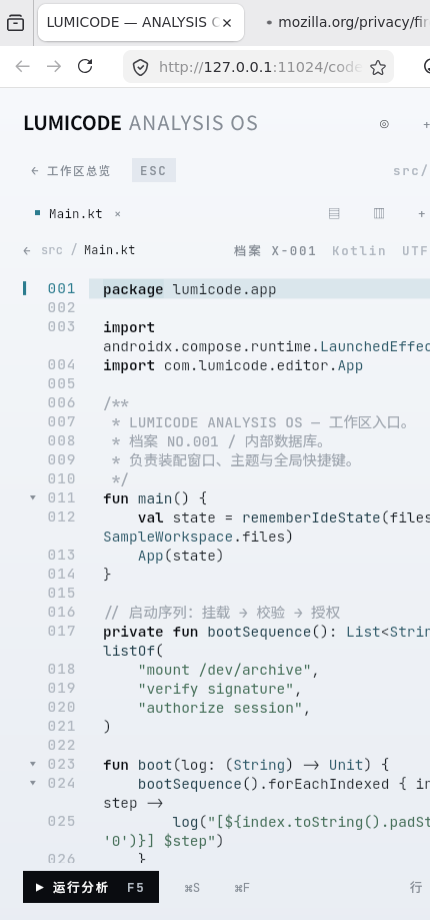
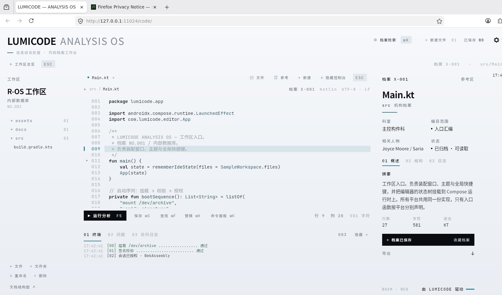

# LumiCode — ANALYSIS OS

一个「档案室／分析终端」风格的代码编辑器 Demo，使用 **Compose Multiplatform** 编写，同一份 UI 代码同时运行在
**Android / Windows / Linux / Web(Wasm)** 四个平台。视觉语言参考了 *RHINE LAB ANALYSIS OS* 那种纸质底色 +
1px 细线 + 微缩等宽标签 + 大写字标的归档界面（未使用 3D 模型，改为纯 2D 版式）。


> 界面以中文为主（品牌名 **LumiCode**；`ANALYSIS OS` / `NO.001` 等装饰性文字保留英文），
> 代码与标签使用 **JetBrains Mono**，设置页与工作区总览见下文。

---

## 1. 已实现的 IDE 基础功能

| 功能 | 说明 |
| --- | --- |
| 文件树 | 左侧工作区：折叠、新建文件/文件夹、重命名、删除（内存虚拟盘） |
| 多标签编辑 | 打开 / 关闭 / `Ctrl+Tab` 切换；未保存圆点 |
| 代码编辑 | 等宽字体、行号、当前行高亮、代码折叠、Tab 缩进、括号/引号补全、显式撤销栈 |
| 语法高亮 | Kotlin / Gradle KTS / JSON / Markdown / 纯文本；括号配对与当前词高亮 |
| 查找替换 | `Ctrl+F` / `Ctrl+H`：上一个/下一个、区分大小写、正则、替换 / 全部替换 |
| 工作区搜索 | `Ctrl+Shift+F`：跨文件命中列表，点击跳到对应行 |
| 跳转到行 | `Ctrl+G` |
| Markdown 预览 | `.md` 默认渲染；面包屑可切「源码 / 预览」 |
| 命令面板 | `Ctrl+K`，键盘上下选择与回车执行 |
| 快速打开 | `Ctrl+P` |
| 输出面板 | 终端 / 问题 / 访问日志；问题页可点击跳行 |
| 分析任务 | `F5` 模拟分析流程，输出到控制台 |
| 参考区 | 元数据、摘要、结构大纲（顶层声明）、访问日志 |
| 状态栏 / 遥测栏 | 行列、字符数、文档数、脏文件、FPS、平台、时钟 |

### 快捷键

| 按键 | 行为 |
| --- | --- |
| `Ctrl/Cmd + K` | 命令面板 |
| `Ctrl/Cmd + P` | 快速打开 |
| `Ctrl/Cmd + Shift + F` | 工作区搜索 |
| `Ctrl/Cmd + G` | 跳转到行 |
| `Ctrl/Cmd + S` | 保存（虚拟档案） |
| `Ctrl/Cmd + F` / `H` | 查找 / 查找替换 |
| `Ctrl/Cmd + N` / `W` | 新建 / 关闭文档 |
| `Ctrl/Cmd + Tab` | 下一个标签（`Shift` 上一个） |
| `Ctrl/Cmd + B` / `J` / `R` | 资源管理器 / 控制台 / 参考区 |
| `Ctrl/Cmd + E` | 导出档案包（演示） |
| `F5` | 运行分析 |
| `Esc` | 关浮层 → 关查找 → 打开工作区总览 |

### 设置页 / 工作区总览 / 键盘行为

- **设置页**：右上角 ⚙ 或命令面板「打开设置」；可调字号、制表符、行号、遥测栏、面板显隐。
- **工作区总览**：顶部「← 工作区总览」、空闲时 `ESC`、或「文档结构图」入口；显示统计与文档列表。
- **ESC 分级**：树弹层 → 浮层 → 查找栏 → 否则打开工作区总览。
- **浮层动效**：遮罩与面板各自淡入淡出（无方向滑动）。
- **字号**：代码默认 14sp（设置可调）；界面标签约 11–12sp。

### 自适应：桌面宽屏 / 手机窄屏

宽度 < 900dp 时收起左右栏，资源管理器与参考区改为抽屉。

| 手机窄屏（430×920） | Web (Wasm) |
| --- | --- |
|  |  |

更多截图：
[编辑](docs/screenshots/02-editing.png) ·
[命令面板](docs/screenshots/03-command-index.png) ·
[查找](docs/screenshots/04-find-in-document.png) ·
[分析](docs/screenshots/05-analysis-pass.png) ·
[设置](docs/screenshots/06-settings.png) ·
[工作区总览](docs/screenshots/07-workspace-overview.png) ·
[Markdown 预览](docs/screenshots/11-markdown-preview.png) ·
[查找替换](docs/screenshots/12-find-replace.png) ·
[行高亮细节](docs/screenshots/10-line-highlight-detail.png)。

截图可用：

```bash
# 需本机已发布 Wasm（./deploy/publish-web.sh）且安装 firefox
nix-shell -p xorg-server xdotool imagemagick --run ./tools/capture_screenshots.sh
```

---

## 2. 直接下载安装包（Releases）

不想自己编译的话，去 **[Releases → latest](https://github.com/TetraploidHuman/LumiCode/releases/latest)** 直接下载：

- **Windows（推荐，免安装）**：[`LumiCode-portable.exe`](https://github.com/TetraploidHuman/LumiCode/releases/latest/download/LumiCode-portable.exe)
  —— **单文件，双击即运行**：内含完整 JRE；双击后先静默自解压到 `%TEMP%`
  再启动（首次约 20–40 秒），关闭程序后临时目录自动清理
- Windows（反复使用更快）：[`LumiCode-windows-portable.zip`](https://github.com/TetraploidHuman/LumiCode/releases/latest/download/LumiCode-windows-portable.zip)
- Windows（安装版）：[`LumiCode-1.0.0.msi`](https://github.com/TetraploidHuman/LumiCode/releases/latest/download/LumiCode-1.0.0.msi)
- **Android**：[`LumiCode-android-release.apk`](https://github.com/TetraploidHuman/LumiCode/releases/latest/download/LumiCode-android-release.apk)
- Linux / Web：`lumicode_*.deb` 与 `LumiCode-web-wasm.zip`

> Windows 产物内置 JRE，**不需要预装 Java**。无代码签名时 SmartScreen 可能提示「未知发布者」，选「仍要运行」即可。

| 平台 | 文件 | 用法 |
| --- | --- | --- |
| Windows | `LumiCode-portable.exe` | 双击即运行（免安装） |
| Windows | `LumiCode-windows-portable.zip` | 解压后运行 `LumiCode.exe` |
| Windows | `LumiCode-1.0.0.msi` | 安装版 |
| Android | `LumiCode-android-release.apk` | 允许未知来源后安装 |
| Linux | `lumicode_*.deb` | `sudo dpkg -i …` |
| Web | `LumiCode-web-wasm.zip` | 静态服务器托管 |

由 [`.github/workflows/build.yml`](.github/workflows/build.yml) 构建；打 `v*` 标签或手动 `Run workflow` 发布。

---

## 3. 运行方式

环境要求：**JDK 17+**（推荐 **21**；Java 25 可能无法编译）。Android 需 SDK。

```bash
./gradlew :composeApp:run                              # 桌面
./gradlew :composeApp:wasmJsBrowserDevelopmentRun      # Web 开发
./gradlew :composeApp:wasmJsBrowserDistribution        # Web 静态产物
./gradlew :composeApp:assembleDebug                    # Android APK
```

### 部署到本机 Caddy（`http://<host>:11024/code/`）

见 [`deploy/README.md`](deploy/README.md)：

```bash
./gradlew :composeApp:wasmJsBrowserDistribution && ./deploy/publish-web.sh
```

```bash
python3 tools/serve_wasm.py                       # http://127.0.0.1:8080
```

---

## 4. 工程结构

```
composeApp/src/commonMain/kotlin/com/lumicode/editor/
├── App.kt                 # 外壳、全局快捷键
├── state/IdeState.kt      # 标签、内容、查找、浮层、树操作
├── syntax/SyntaxHighlighter.kt
└── ui/
    ├── CodeEditor.kt / CodeFolding.kt
    ├── MarkdownPreview.kt
    ├── EditorPanel.kt / Overlay.kt / ReferencePanel.kt
    └── theme/RhineTheme.kt
tools/build_font_subset.py / build_mono_font.py / capture_screenshots.sh
```

### 实现要点

- **编辑区**：`BasicTextField` + `VisualTransformation`，四端一致；折叠改偏移映射。
- **虚拟文件系统**：`SampleWorkspace` 内存盘；新建/重命名/删除刷新即丢。
- **字体**：Wasm 无系统回退，内置 JetBrains Mono + Noto Sans CJK 子集；UI 新字后需重跑子集脚本。
- **Markdown**：自研轻量块解析（标题/列表/表格/代码块/行内强调），不依赖外部库。

---

## 5. 已验证内容

| 目标 | 验证方式 | 结果 |
| --- | --- | --- |
| Desktop (Linux) | Xvfb 启动 + 键鼠 | 快捷键与浮层可用 |
| Web (Wasm) | 本机 Caddy `/code/` + 截图 | 与桌面一致 |
| Windows / Android | CI 产物 | 见 Releases |

## 6. 已知限制（Demo 范围）

- 无真实文件 IO、LSP、Git；「运行分析」为模拟输出。
- 无多光标；撤销为编辑器内显式栈，非系统级。
- 高亮为正则词法级。
- 字体子集只含源码出现过的汉字；生僻字需重做子集。
- 桌面最小窗口约 1180×720；`LUMICODE_WINDOW_SIZE=430x920` 可预览窄屏。
